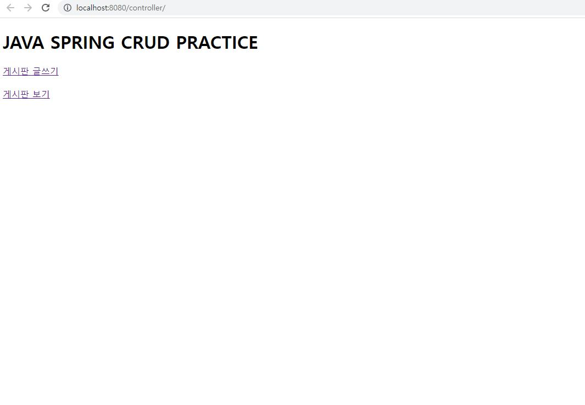
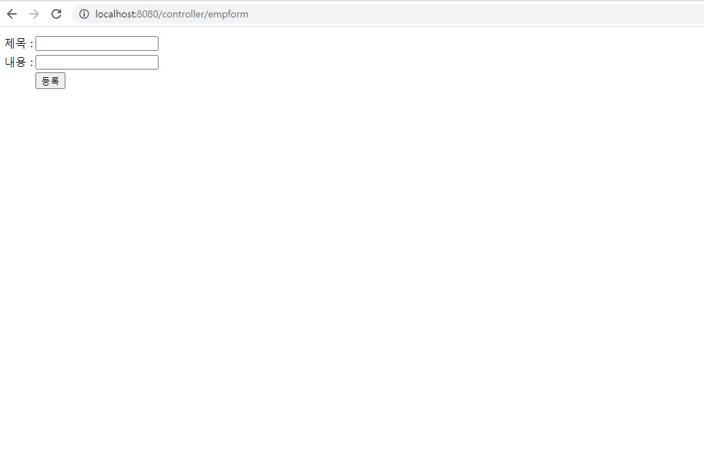
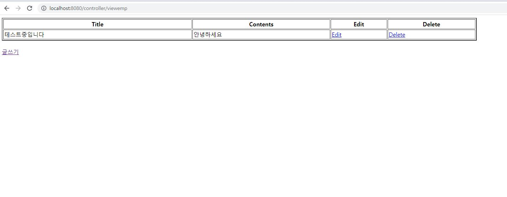
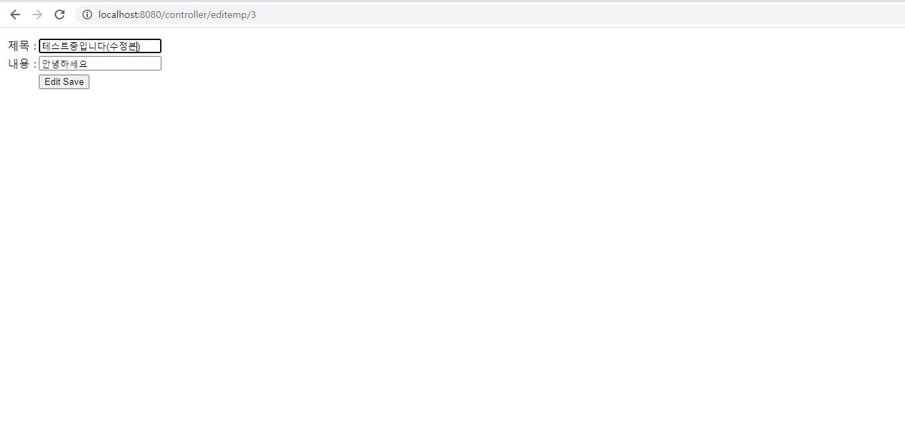
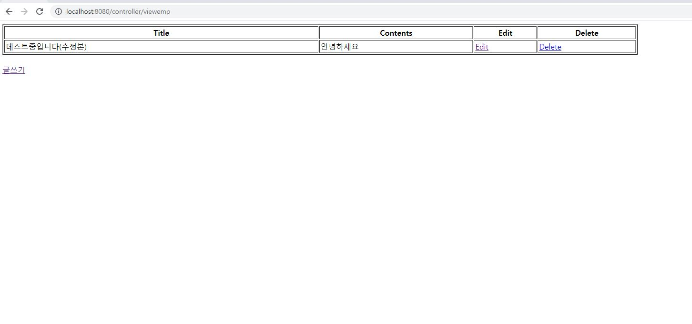

## Spring Crud 

1. 환경설정

* server : tomcat 9.0
* java 11.0.15.1
* spring
* mysql- 8.0.11


2. 게시판 만들기 schema

* beans
  * Emp.java
* controller
  * EmpController
* dao
  * EmpDao
* web-inf
  * web.xml
  * spring-serverlet.xml
* jsp
  * empditform
  * empform
  * viewemp


3. code

   ```java
   emp.java
       
   package com.test.beans;
   
   public class Emp {
   	private int id;
   	private String title;
   	private String contents;
   
   	public int getId() {
   		return id;
   	}
   
   	public void setId(int id) {
   		this.id = id;
   	}
   
   	public String getTitle() {
   		return title;
   	}
   
   	public void setTitle(String title) {
   		this.title = title;
   	}
   
   	public String getContents() {
   		return contents;
   	}
   
   	public void setContents(String contents) {
   		this.contents = contents;
   	}
   
   }
   ```

   ```java
   empcontroller.java
   
   package com.test.controller;
   import java.util.List;  
   import org.springframework.beans.factory.annotation.Autowired;  
   import org.springframework.stereotype.Controller;
   import org.springframework.ui.Model;
   import org.springframework.web.bind.annotation.ModelAttribute;  
   import org.springframework.web.bind.annotation.PathVariable;  
   import org.springframework.web.bind.annotation.RequestMapping;  
   import org.springframework.web.bind.annotation.RequestMethod;   
   import com.test.beans.Emp;  
   import com.test.dao.EmpDao;  
   @Controller  
   public class EmpController {  
       @Autowired  
       EmpDao dao;//will inject dao from xml file  
         
       /*It displays a form to input data, here "command" is a reserved request attribute 
        *which is used to display object data into form 
        */  
       @RequestMapping("/empform")  
       public String showform(Model m){  
       	m.addAttribute("command", new Emp());
       	return "empform"; 
       }  
       /*It saves object into database. The @ModelAttribute puts request data 
        *  into model object. You need to mention RequestMethod.POST method  
        *  because default request is GET*/  
       @RequestMapping(value="/save",method = RequestMethod.POST)  
       public String save(@ModelAttribute("emp") Emp emp){  
           dao.save(emp);  
           return "redirect:/viewemp";//will redirect to viewemp request mapping  
       }  
       /* It provides list of employees in model object */  
       @RequestMapping("/viewemp")  
       public String viewemp(Model m){  
           List<Emp> list=dao.getList();  
           m.addAttribute("list",list);
           return "viewemp";  
       }  
       /* It displays object data into form for the given id.  
        * The @PathVariable puts URL data into variable.*/  
       @RequestMapping(value="/editemp/{id}")  
       public String edit(@PathVariable int id, Model m){  
           Emp emp=dao.getEmpById(id);  
           m.addAttribute("command",emp);
           return "empeditform";  
       }  
       /* It updates model object. */  
       @RequestMapping(value="/editsave",method = RequestMethod.POST)  
       public String editsave(@ModelAttribute("emp") Emp emp){  
           dao.update(emp);  
           return "redirect:/viewemp";  
       }  
       /* It deletes record for the given id in URL and redirects to /viewemp */  
       @RequestMapping(value="/deleteemp/{id}",method = RequestMethod.GET)  
       public String delete(@PathVariable int id){  
           dao.delete(id);  
           return "redirect:/viewemp";  
       }   
   }  
   ```

   ```java
   empdao.java
   
   package com.test.dao;
   
   import java.sql.ResultSet;
   import java.sql.SQLException;
   import java.util.List;
   import org.springframework.jdbc.core.BeanPropertyRowMapper;
   import org.springframework.jdbc.core.JdbcTemplate;
   import org.springframework.jdbc.core.RowMapper;
   import com.test.beans.Emp;
   
   public class EmpDao {
   	JdbcTemplate template;
   
   	public void setTemplate(JdbcTemplate template) {
   		this.template = template;
   	}
   
   	public int save(Emp p) {
   		String sql = "insert into test_crud(title,contents) values('" + p.getTitle() + "', '" + p.getContents() +"' )"; 
   		return template.update(sql);
   	}
   
   	public int update(Emp p) {
   		String sql = "update test_crud set title='" + p.getTitle() + "' , contents='"+ p.getContents() + "' where id=" + p.getId() + "";
   		return template.update(sql);
   	}
   
   	public int delete(int id) {
   		String sql = "delete from test_crud where id=" + id + "";
   		return template.update(sql);
   	}
   
   	public Emp getEmpById(int id) {
   		String sql = "select * from test_crud where id=?";
   		return template.queryForObject(sql, new Object[] { id }, new BeanPropertyRowMapper<Emp>(Emp.class));
   	}
   
   	public List<Emp> getList() {
   		return template.query("select * from test_crud", new RowMapper<Emp>() {
   			public Emp mapRow(ResultSet rs, int row) throws SQLException {
   				Emp e = new Emp();
   				e.setId(rs.getInt(1));
   				e.setTitle(rs.getString(2));
   				e.setContents(rs.getString(3));
   				return e;
   			}
   		});
   	}
   }
   ```

   ```java
   spring-serverlet.xml
   
   <?xml version="1.0" encoding="UTF-8"?>
   <beans xmlns="http://www.springframework.org/schema/beans"  
       xmlns:xsi="http://www.w3.org/2001/XMLSchema-instance"  
       xmlns:p="http://www.springframework.org/schema/p"  
       xmlns:context="http://www.springframework.org/schema/context"  
       xsi:schemaLocation="http://www.springframework.org/schema/beans  
   http://www.springframework.org/schema/beans/spring-beans-3.0.xsd  
   http://www.springframework.org/schema/context  
   http://www.springframework.org/schema/context/spring-context-3.0.xsd">  	
   
   <context:component-scan base-package="com.test"></context:component-scan>
   
        <-- serverlet 관련 정보를 담고 있는 코드 -->
   <bean class="org.springframework.web.servlet.view.InternalResourceViewResolver">
   <property name="prefix" value="/WEB-INF/jsp/"></property>
   <property name="suffix" value=".jsp"></property> 
   </bean>
   
        <-- mysql 관련 정보를 담고 있는 코드 -->
   <bean id="ds" class="org.springframework.jdbc.datasource.DriverManagerDataSource">  
   <property name="driverClassName" value="com.mysql.jdbc.Driver"></property>  
   <property name="url" value="jdbc:mysql://localhost:3306/test_db01?serverTimezone=UTC"></property>  
   <property name="username" value="root"></property>  
   <property name="password" value="1234"></property>  
   </bean>  
   
   <bean id="jt" class="org.springframework.jdbc.core.JdbcTemplate">
   <property name="dataSource" ref="ds"></property>
   </bean>
   
   <bean id="dao" class="com.test.dao.EmpDao">
   <property name="template" ref="jt"></property>
   </bean>
   </beans>
   ```

   ```java
   web.xml
   
   <?xml version="1.0" encoding="UTF-8"?>
   <web-app version="2.5" xmlns="http://java.sun.com/xml/ns/javaee"
   	xmlns:xsi="http://www.w3.org/2001/XMLSchema-instance"
   	xsi:schemaLocation="http://java.sun.com/xml/ns/javaee https://java.sun.com/xml/ns/javaee/web-app_2_5.xsd">
     <context-param>
   		<param-name>contextConfigLocation</param-name>
   		<param-value>/WEB-INF/spring-servlet.xml</param-value>
   	</context-param>
     
     <display-name>SpringMVC</display-name>
      <servlet>  
       <servlet-name>spring</servlet-name>  
       <servlet-class>org.springframework.web.servlet.DispatcherServlet</servlet-class>  
       <load-on-startup>1</load-on-startup>    
   </servlet>  
   <servlet-mapping>  
       <servlet-name>spring</servlet-name>  
       <url-pattern>/</url-pattern>  
   </servlet-mapping>  
           
            <-- 한국어가 깨지는 것을 막아주는 코드 -->
   <filter> 
       <filter-name>encodingFilter</filter-name> 
       <filter-class>org.springframework.web.filter.CharacterEncodingFilter</filter-class> 
       <init-param> 
          <param-name>encoding</param-name> 
          <param-value>UTF-8</param-value> 
       </init-param> 
       <init-param> 
          <param-name>forceEncoding</param-name> 
          <param-value>true</param-value> 
       </init-param> 
    </filter> 
    <filter-mapping> 
       <filter-name>encodingFilter</filter-name> 
       <url-pattern>/*</url-pattern> 
    </filter-mapping> 
   </web-app>
   
   
   ```

   ```java
   pom.xml
   
   ?xml version="1.0" encoding="UTF-8"?>
   <project xmlns="http://maven.apache.org/POM/4.0.0" xmlns:xsi="http://www.w3.org/2001/XMLSchema-instance"
   	xsi:schemaLocation="http://maven.apache.org/POM/4.0.0 https://maven.apache.org/maven-v4_0_0.xsd">
   	<modelVersion>4.0.0</modelVersion>
   	<groupId>com.test</groupId>
   	<artifactId>controller</artifactId>
   	<name>CRUD</name>
   	<packaging>war</packaging>
   	<version>1.0.0-BUILD-SNAPSHOT</version>
   	<properties>
   		<java-version>1.6</java-version>
   		<org.springframework-version>3.1.1.RELEASE</org.springframework-version>
   		<org.aspectj-version>1.6.10</org.aspectj-version>
   		<org.slf4j-version>1.6.6</org.slf4j-version>
   	</properties>
   	<dependencies>
   		<!-- Spring 
   		<dependency>
   			<groupId>org.springframework</groupId>
   			<artifactId>spring-context</artifactId>
   			<version>${org.springframework-version}</version>
   			<exclusions>
   
   				<exclusion>
   					<groupId>commons-logging</groupId>
   					<artifactId>commons-logging</artifactId>
   				 </exclusion>
   			</exclusions>
   		</dependency>-->
   		<dependency>
   			<groupId>org.springframework</groupId>
   			<artifactId>spring-webmvc</artifactId>
   			<version>5.1.1.RELEASE</version>
   		</dependency>
   				
   		<!-- AspectJ -->
   		<dependency>
   			<groupId>org.aspectj</groupId>
   			<artifactId>aspectjrt</artifactId>
   			<version>${org.aspectj-version}</version>
   		</dependency>	
   		
   		<!-- Logging -->
   		<dependency>
   			<groupId>org.slf4j</groupId>
   			<artifactId>slf4j-api</artifactId>
   			<version>${org.slf4j-version}</version>
   		</dependency>
   		<dependency>
   			<groupId>org.slf4j</groupId>
   			<artifactId>jcl-over-slf4j</artifactId>
   			<version>${org.slf4j-version}</version>
   			<scope>runtime</scope>
   		</dependency>
   		<dependency>
   			<groupId>org.slf4j</groupId>
   			<artifactId>slf4j-log4j12</artifactId>
   			<version>${org.slf4j-version}</version>
   			<scope>runtime</scope>
   		</dependency>
   		<dependency>
   			<groupId>log4j</groupId>
   			<artifactId>log4j</artifactId>
   			<version>1.2.15</version>
   			<exclusions>
   				<exclusion>
   					<groupId>javax.mail</groupId>
   					<artifactId>mail</artifactId>
   				</exclusion>
   				<exclusion>
   					<groupId>javax.jms</groupId>
   					<artifactId>jms</artifactId>
   				</exclusion>
   				<exclusion>
   					<groupId>com.sun.jdmk</groupId>
   					<artifactId>jmxtools</artifactId>
   				</exclusion>
   				<exclusion>
   					<groupId>com.sun.jmx</groupId>
   					<artifactId>jmxri</artifactId>
   				</exclusion>
   			</exclusions>
   			<scope>runtime</scope>
   		</dependency>
   
   		<!-- @Inject -->
   		<dependency>
   			<groupId>javax.inject</groupId>
   			<artifactId>javax.inject</artifactId>
   			<version>1</version>
   		</dependency>
   				
   		<!-- Servlet -->
   		<dependency>
   			<groupId>javax.servlet</groupId>
   			<artifactId>servlet-api</artifactId>
   			<version>2.5</version>
   			<scope>provided</scope>
   		</dependency>
   		<dependency>
   			<groupId>javax.servlet.jsp</groupId>
   			<artifactId>jsp-api</artifactId>
   			<version>2.1</version>
   			<scope>provided</scope>
   		</dependency>
   		<dependency>
   			<groupId>javax.servlet</groupId>
   			<artifactId>jstl</artifactId>
   			<version>1.2</version>
   		</dependency>
   	
   		<!-- Test -->
   		<dependency>
   			<groupId>junit</groupId>
   			<artifactId>junit</artifactId>
   			<version>4.7</version>
   			<scope>test</scope>
   		</dependency>  
   		
   
   
   <!-- https://mvnrepository.com/artifact/org.apache.tomcat/tomcat-jasper -->
   <dependency>
       <groupId>org.apache.tomcat</groupId>
       <artifactId>tomcat-jasper</artifactId>
       <version>9.0.63</version>
   </dependency>
   
       <!-- https://mvnrepository.com/artifact/mysql/mysql-connector-java -->
   <dependency>
       <groupId>mysql</groupId>
       <artifactId>mysql-connector-java</artifactId>
       <version>8.0.11</version>
   </dependency>
       <!-- https://mvnrepository.com/artifact/org.springframework/spring-jdbc -->
   <dependency>
       <groupId>org.springframework</groupId>
       <artifactId>spring-jdbc</artifactId>
       <version>5.1.1.RELEASE</version>
   </dependency>
   		      
   	</dependencies>
       <build>
           <plugins>
               <plugin>
                   <artifactId>maven-eclipse-plugin</artifactId>
                   <version>2.9</version>
                   <configuration>
                       <additionalProjectnatures>
                           <projectnature>org.springframework.ide.eclipse.core.springnature</projectnature>
                       </additionalProjectnatures>
                       <additionalBuildcommands>
                           <buildcommand>org.springframework.ide.eclipse.core.springbuilder</buildcommand>
                       </additionalBuildcommands>
                       <downloadSources>true</downloadSources>
                       <downloadJavadocs>true</downloadJavadocs>
                   </configuration>
               </plugin>
               <plugin>
                   <groupId>org.apache.maven.plugins</groupId>
                   <artifactId>maven-compiler-plugin</artifactId>
                   <version>2.5.1</version>
                   <configuration>
                       <source>1.6</source>
                       <target>1.6</target>
                       <compilerArgument>-Xlint:all</compilerArgument>
                       <showWarnings>true</showWarnings>
                       <showDeprecation>true</showDeprecation>
                   </configuration>
               </plugin>
               <plugin>
                   <groupId>org.codehaus.mojo</groupId>
                   <artifactId>exec-maven-plugin</artifactId>
                   <version>1.2.1</version>
                   <configuration>
                       <mainClass>org.test.int1.Main</mainClass>
                   </configuration>
               </plugin>
           </plugins>
       </build>
   </project>
   
   ```

   

   #### 시작페이지

   

#### 글쓰기페이지



#### 게시판 목록 페이지



#### 게시판 수정 페이지



#### 수정확인

